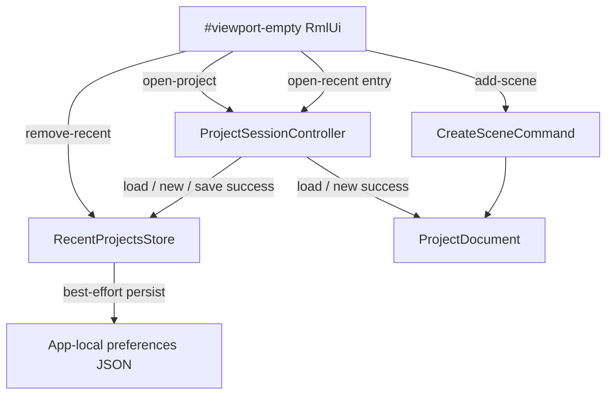

# ADR-0030 — Empty Scene Hub (Recent Projects)

**Status:** Accepted  
**Date:** 2026-07-26  
**Scope:** Decision only. Future native RmlUi empty-scene hub and app-local recent-projects persistence; no implementation in this slice.  
**Gate classification:** Engineering Gates §3 — RmlUi UI surface plus platform preferences persistence.  
**Related:** Architecture Constitution, Engineering Gates, ADR-0017, ADR-0027,
[`LOGIC_BOARD_RULES_ROADMAP.md`](LOGIC_BOARD_RULES_ROADMAP.md),
[`editor_shell.rml`](../src/editor-native/resources/ui/editor_shell.rml)

## Context

The Scene workspace already has an empty-state overlay, `#viewport-empty`, in
`src/editor-native/resources/ui/editor_shell.rml`. It currently contains only:

- the title `No scene open`;
- a short explanatory subtitle;
- `Create Scene`, routed through `data-action="add-scene"`.

Its visibility is already controlled by `EditorUi` using the existing Scene
workspace state:

```text
show empty surface when:
    !hasScene
    && !playing
    && sceneWorkspace

hide empty surface when:
    hasScene
    || playing
    || !sceneWorkspace
```

That visibility contract remains authoritative. ADR-0030 changes the contents
of the existing empty surface; it does not introduce a second welcome window or
another workspace.

Scenes are not standalone files. A Scene is part of `ProjectDocument`, and the
persisted unit opened from disk is an `.artcade-project` file. Native project
selection already enters through `openProjectFileDialog()` and project loading
is owned by `ProjectSessionController::requestOpenProject()` and its existing
load/replace transaction.

The editor currently has no most-recently-used project list. Consequently, when
a project has no Scene, the central workspace provides no direct route to an
existing project other than the File menu.

React, `localStorage`, `.artscene`, Electron, and legacy web/WASM UI models are
not applicable. The binding stack for this decision is native C++ plus RmlUi.

## Decision

### Existing empty surface becomes the hub

`#viewport-empty` becomes a compact three-block hub inside the Scene viewport:

1. header and explanation;
2. two adjacent primary workflow actions;
3. recent projects.

It remains an overlay inside the existing Scene workspace. It is not a separate
full-window welcome screen and does not own project or scene state.

Indicative layout:

```text
┌──────────────────────────────────────────────────────────────┐
│                        No scene open                         │
│      Create a scene or open an existing ArtCade project.    │
│                                                              │
│           [ + Create Scene ]  [ Open Project… ]              │
│                                                              │
│  Recent Projects                                             │
│  ──────────────────────────────────────────────────────────  │
│  Platformer Demo                                             │
│  C:\Projects\Platformer Demo\game.artcade-project       [×] │
│                                                              │
│  Puzzle Prototype                                            │
│  D:\ArtCade\Puzzle\puzzle.artcade-project               [×] │
└──────────────────────────────────────────────────────────────┘
```

The wireframe fixes information hierarchy, not exact dimensions. Visual roles
must reuse ADR-0027. The feature introduces no new UI stack and no local colour
palette.

### Primary actions

| UI action | Required application path |
|---|---|
| `Create Scene` | Existing `add-scene` route → `CreateSceneCommand` → `SelectSceneIntent` |
| `Open Project…` | Existing `open-project` route → `ProjectSessionController::requestOpenProject()` → native file dialog |
| Recent-project row | Path-based entry into the same session load/replace workflow used by Open Project |
| Recent-project remove `×` | `RecentProjectsStore` only |

`Create Scene` must not acquire a second implementation. The hub invokes the
same path already used by the Hierarchy and existing empty state.

`Open Project…` means project, not scene. The UI must not introduce `Open Scene`,
`.artscene`, or any direct Scene-file load operation.

Opening a recent project must converge on the same application service and
unsaved-change guard as normal Open Project. The RmlUi controller must not call
`loadProjectFromFile()` directly and must not duplicate replace, texture-cache,
window-title, or error handling.

### Recent-project model

The MRU contains projects, never standalone scenes.

Conceptual entry:

```text
RecentProjectEntry
    path
    displayName
    lastOpenedUtc
```

Binding semantics:

- `path` is the application-normalized project path used to reopen the
  `.artcade-project` file;
- `displayName` is derived from the path stem or filename and is presentation
  metadata, not project identity;
- `lastOpenedUtc` is the UTC timestamp of the last successful touch and drives
  ordering;
- matching paths are deduplicated;
- a successful touch moves the entry to the first position;
- the store has a fixed maximum of **10** entries;
- entries beyond the cap are discarded from the end.

A touch occurs only after an operation has succeeded and established a concrete
project path:

- successful Open Project;
- successful Open Recent Project;
- successful Save or Save As;
- successful New Project transaction.

Cancelled or failed operations do not mutate the MRU.

### Missing paths

Activating a recent entry performs an existence check at the application layer,
not in RmlUi.

```text
path exists
    → enter the normal guarded project-open workflow

filesystem inspection error
    → do not attempt project load
    → keep the recent entry
    → log an explicit error

path definitively missing
    → do not attempt project load
    → remove the entry from RecentProjectsStore
    → persist preferences best-effort
    → refresh the visible hub
    → log an informational warning
```

A definitively missing project is removed automatically when the user explicitly
attempts to open it. No filesystem polling or background cleanup is performed.
The `×` affordance remains available for voluntary removal of valid or
temporarily unavailable entries, and its activation must not bubble into the
row-open action.

Existence is checked when the entry is activated, and optionally when the
targeted hub projection is rebuilt (definitive absence only; inspection errors
do not show the missing badge).

Corrupted or incompatible project files still exist on disk: they are not
auto-removed. Load failure after a successful existence check leaves the MRU
entry in place.

### Active Scene restoration

ADR-0030 does not persist `lastSceneId`.

After a project load, active-scene reconciliation continues to use the current
editor behavior (`normalizedSceneId`, the document start Scene, and existing
workspace reconciliation). The MRU does not become an authority for Scene
selection.

If the opened project has no Scene, the hub remains visible after load and the
project is touched in the MRU. The user can then create its first Scene through
the existing command path.

## Authority

| Data or behavior | Owner |
|---|---|
| Project and Scene definitions | `ProjectDocument`, mutated only through Commands or atomic replace-on-load |
| Active Scene selection | `EditorState`, changed through Intent |
| Panel and visual layout state | `EditorUiState` |
| Recent projects | New app-local `RecentProjectsStore` in the application/platform preferences layer |
| Hub markup and interaction forwarding | RmlUi / `EditorUi`, presentation only |
| Open/New/Save workflow and unsaved guard | `ProjectSessionController` |

The MRU is not:

- part of `ProjectDocument`;
- part of `EditorState`;
- panel layout state in `EditorUiState`;
- runtime state in `PlaySession`;
- an Undo/Redo concern.

### Preferences persistence

`RecentProjectsStore` is a concrete application service backed by app-local
preferences JSON. It is not a generic domain repository and does not justify a
new event bus, manager hierarchy, or preferences framework.

The store is outside every project directory. Its persistence must be
best-effort and isolated from project success:

- a project Open/New/Save that succeeds remains successful if MRU persistence
  fails;
- persistence failure is logged as a preferences warning;
- malformed preferences do not block editor startup or project loading;
- invalid entries are ignored or reported without mutating `ProjectDocument`;
- future implementation should use a transactional/atomic file replacement at
  the platform preferences boundary.

No Command is created for touch, remove, deduplication, sorting, or persistence.
These operations produce no project revision, dirty state, or history entry.

## Mutation and refresh flow



RmlUi only forwards semantic actions and renders a projection. It never mutates
the MRU container directly and never owns the selected project path.

Refresh is explicit and targeted:

- when `#viewport-empty` becomes visible;
- after a successful MRU touch;
- after an explicit remove;
- after preferences are initially loaded, if the hub is visible.

There is no per-frame `RefreshAll()`, no polling, and no background synchronizer.
When the overlay is hidden, refresh may be deferred until it becomes visible.

## Edit and Play behavior

The existing visibility rule hides the hub during Play.

Project New/Open operations remain guarded by `ProjectSessionController`; they
must not bypass the existing Play rejection or unsaved-change workflow merely
because they originated from the hub.

MRU rendering and removal are presentation/preferences operations. They do not
materialize into `PlaySession` and are never read by the runtime.

## UI and theme contract

The hub remains native RmlUi and reuses the established zinc/accent design
system from ADR-0027.

- Component-specific RCSS owns structure, spacing, sizing, overflow, and
  typography only.
- Feature selectors join existing ADR-0027 role groups in `theme.rcss`.
- No colour literal is introduced outside `theme.rcss`.
- No `var(--*)` syntax is used; RmlUi RCSS has no CSS custom properties.
- Any flex row wraps visible text in explicit `<span>` elements.
- Dynamic names and paths are escaped before insertion into generated RML.

The recent list should provide:

- project display name as the primary label;
- full or safely elided path as secondary text with the full path available in a
  tooltip;
- a dedicated remove control;
- an explicit missing/unavailable state that does not rely on colour alone;
- a simple empty state when no recent projects exist.

`lastOpenedUtc` is authoritative for ordering. Displaying a human-readable date
is optional for the first implementation and must not become another persisted
field.

## Constitution and Engineering Gates

This decision preserves the governing invariants:

- RmlUi is presentation only;
- `ProjectDocument` remains the sole persistent project authority;
- Scene creation remains Command-driven;
- active Scene selection remains Intent-driven workspace state;
- project load remains an atomic session boundary;
- app-local preferences do not enter project dirty/revision/history;
- no UI-direct mutation of project or MRU storage;
- no generic event bus, polling loop, hidden sync service, or per-frame rebuild;
- Play remains isolated from authoring and preferences;
- implementation is the minimum sufficient native solution.

Gate classification under Engineering Gates §3 is:

```text
RmlUi UI surface
+
platform/application preferences persistence
```

It is not a new domain subsystem or runtime feature.

## Consequences

### Positive

- the empty Scene workspace becomes useful without adding another window;
- first-time creation and existing-project entry are available in one place;
- recent projects reduce repeated native file-dialog navigation;
- Scene/project terminology remains correct;
- all project opens retain one guarded load path;
- MRU persistence remains independent from project files and runtime;
- the design stays compatible with the native RmlUi architecture.

### Costs

- one small app-local JSON store and projection are required in the future slice;
- session success paths must touch the MRU explicitly;
- the empty overlay requires targeted refresh and missing-path presentation;
- future tests must cover application preferences separately from project state.

### Failure isolation

A broken, missing, or unwritable recent-projects preference file must never:

- prevent editor startup;
- prevent project New/Open/Save;
- alter the active `ProjectDocument`;
- create project dirty state;
- create an Undo entry.

## Out of scope

- C++/RML/RCSS implementation in this documentation slice;
- `.artscene` files;
- standalone Scene open/save dialogs;
- cross-project Scene import;
- a separate full-window welcome screen;
- React UI;
- Electron;
- `localStorage`;
- WASM bridge UI;
- a generic Preferences UI;
- generic settings infrastructure beyond the minimal store boundary;
- shortcut rebinding and Command Palette work from ADR-0024;
- persistence or restoration of `lastSceneId`;
- cloud/project-account synchronization;
- thumbnail generation or project preview images.

## Future implementation notes

The implementation slice is expected to touch only the minimum native surfaces:

- `src/editor-native/resources/ui/editor_shell.rml`
  - replace the contents of `#viewport-empty` with the three-block hub;
- `src/editor-native/resources/ui/panels.rcss`
  - add structure-only hub layout rules;
  - add feature selectors to existing ADR-0027 roles in `theme.rcss`;
- `src/editor-native/ui/editor_ui.cpp`
  - render the recent-project projection and route hub actions;
  - preserve the current empty-overlay visibility predicate;
- `src/editor-native/app/project_session_controller.cpp`
  - make normal Open and recent-path Open converge on one guarded load path;
  - touch the store only after successful New/Open/Save boundaries;
- new application/platform preferences files for `RecentProjectsStore`;
- application/core tests, including coverage in `editor_core_test` or the nearest
  existing application test target.

A future path-based open entry point must remain on `ProjectSessionController`.
It must reuse the normal unsaved guard, Play guard, load transaction, texture
cache invalidation, current-path update, window title update, diagnostics, and
replace semantics.

## Future implementation acceptance criteria

The later code slice is complete only when all of the following are testable:

- `#viewport-empty` still appears only when there is no Scene, the editor is not
  playing, and the Scene workspace is active;
- the hub contains header, adjacent `Create Scene` / `Open Project…` actions,
  and a recent-project list;
- `Create Scene` uses the existing `add-scene` → Command → selection Intent path;
- `Open Project…` uses the existing native project dialog and session workflow;
- a recent row uses the same guarded project load path without a dialog;
- successful New/Open/Save touches and deduplicates the path at the top;
- failed and cancelled operations do not touch the store;
- the store retains at most 10 entries in descending `lastOpenedUtc` order;
- a definitively missing path does not start a load, removes the MRU entry,
  persists preferences best-effort, refreshes the hub, and logs a warning; a
  filesystem inspection error keeps the entry and logs an error; `×` remains
  available for voluntary removal;
- removing a row does not attempt to open it;
- MRU touch/remove creates no Command, revision, dirty state, or Undo entry;
- no `lastSceneId` is stored;
- Play keeps the hub hidden and project-open guards unchanged;
- refresh occurs only on explicit visibility/touch/remove/load boundaries;
- no React, Electron, `localStorage`, `.artscene`, polling, or generic manager is
  introduced;
- style selectors join ADR-0027 roles and feature RCSS remains structure-only;
- generated flex markup contains escaped `<span>` text;
- the store is unit-testable without RmlUi or a live native file dialog;
- the normal native build and relevant test suites remain green.

## Document Definition of Done

This documentation-only slice is complete when:

- this file exists as ADR-0030 with `Status: Accepted`;
- ADR-0029 and earlier decisions remain unchanged;
- `LOGIC_BOARD_RULES_ROADMAP.md` links to this decision without treating it as a
  Logic Board implementation slice;
- the document classifies the future work as RmlUi UI plus platform preferences;
- authority, failure paths, Play behavior, targeted refresh, testable acceptance
  criteria, and explicit exclusions are recorded;
- no source, RML, RCSS, CMake, or test implementation is changed in this slice.
